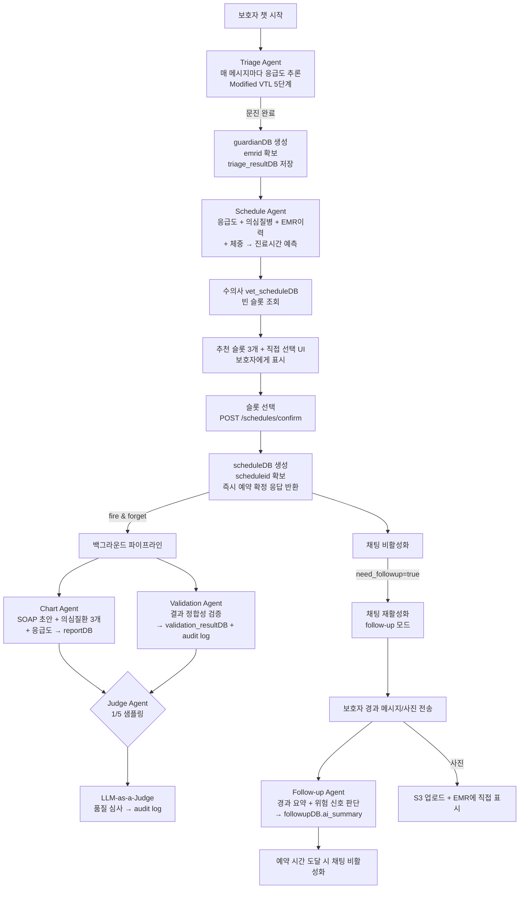
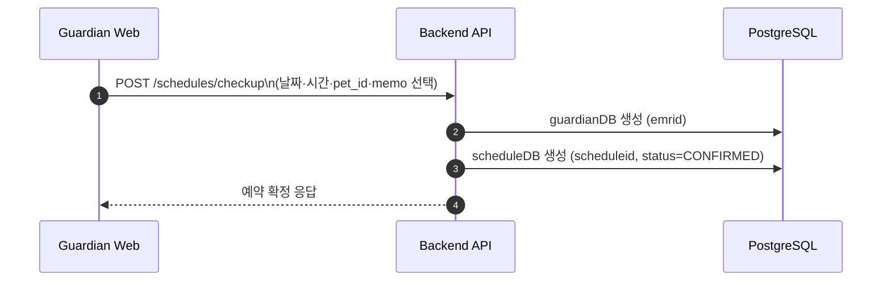
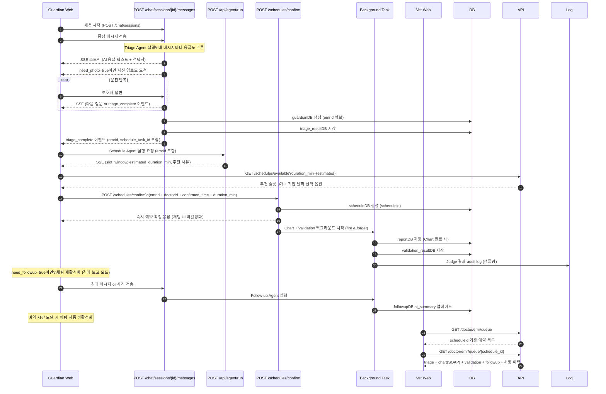
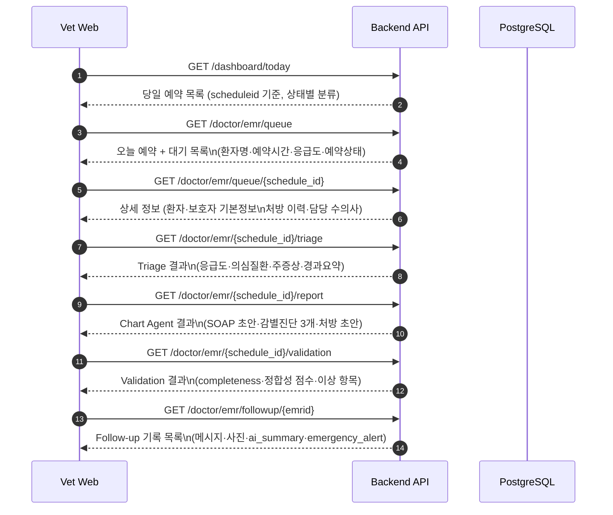
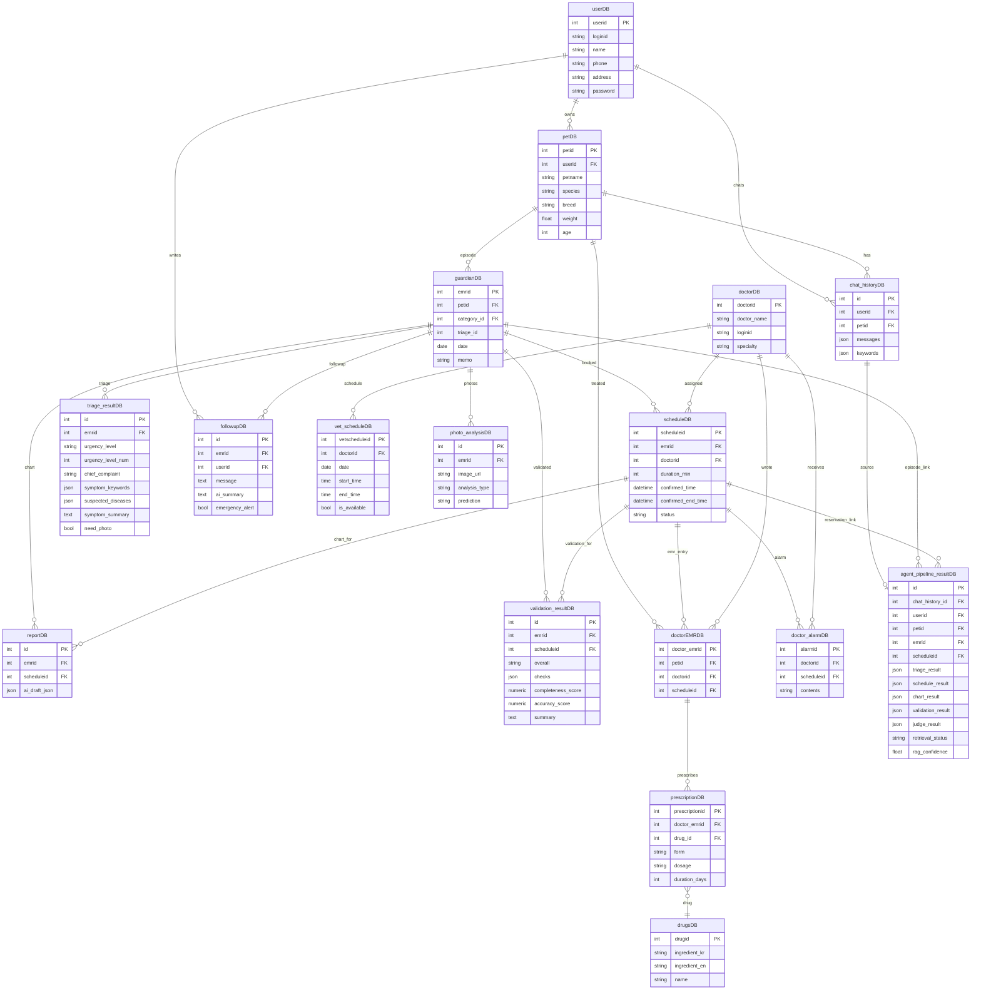

# MediPaw chan 브랜치 인수인계 문서

작성자: chan  
작성일: 2026-05-24  
대상: 이 브랜치를 이어받아 개발할 팀원 전체  
목적: chan 브랜치에서 무엇을 왜 변경했는지, 앞으로 어디서부터 이어가면 되는지 설명

---

## 1. 이 브랜치는 무엇인가

`SKN25-FINAL-1Team` 리포지토리의 `main` 브랜치(원본 팀 백엔드/프론트/인프라)에서 시작해서 아래 세 가지를 붙인 통합 브랜치다.

1. **AI 6-에이전트 파이프라인** (Triage → Schedule → Chart → Validation → Judge → Follow-up)
2. **OpenAI 기반 실시간 챗봇** (하드코딩 응답 → AI 스트리밍 SSE)
3. **예약 후 백그라운드 파이프라인** (Chart + Validation + Judge, fire-and-forget)

진행 순서:
- `integrate` 브랜치에 에이전트 + Docker 통합 후 도커 담당 팀원이 Docker 수정해서 재업
- 그것을 pull 해서 에이전트 고도화 + DB/API 연결 작업이 chan 브랜치에 있는 현재 상태

---

## 2. main 대비 주요 변경사항

### 2.1 백엔드 코드

| 영역 | main 상태 | chan 변경 |
|---|---|---|
| `/chat` 챗봇 응답 | 하드코딩 텍스트 반환 | OpenAI GPT 스트리밍 SSE, Triage Agent 연동 |
| AI 에이전트 | 없음 | `ai/agents/` 6개 에이전트 추가 |
| 예약 확정 후 처리 | 없음 | post-booking 백그라운드 파이프라인 (Chart + Validation + Judge) |
| Follow-up API | 없음 (`/followup`) | `POST /followup`, `GET /followup/{emrid}` 추가 |
| EMR Queue API | 없음 | `GET /doctor/emr/queue`, `GET /doctor/emr/queue/{schedule_id}` 추가 |
| EMR 상세 API | 없음 | `/doctor/emr/{schedule_id}/report`, `triage`, `validation`, `followup` 추가 |
| SSE task store | 없음 | in-memory `_task_store` + `GET /api/agent/sse/{task_id}` |
| Agent runner | 없음 | `POST /api/agent/run` |
| doctorEMRDB 스키마 | `vet_memo(JSON)`, `attachments(JSON)` 컬럼 있음 | 두 컬럼 제거 (Chart Agent가 `reportDB`에 저장하는 구조로 전환) |
| userDB | `address` 컬럼 없음(model) | model에 `address` 복구 |

### 2.2 마이그레이션

원본 `9f8fbd8c0bf0` 마이그레이션은 `userDB.address` drop, `doctorDB.business_number` unique constraint, `drugsDB` 컬럼 drop 등 수십 개의 destructive 변경이 섞여 있어 운영 DB에 그대로 적용하면 위험했다.

chan 브랜치에서 다음과 같이 재구성했다:

| 마이그레이션 파일 | 내용 | 안전 여부 |
|---|---|---|
| `9f8fbd8c0bf0` (재작성) | followupDB에 `ai_summary`, `emergency_alert` 추가, `validation_resultDB`에 debug 필드 추가, `agent_pipeline_resultDB` 생성 | `_has_column` / `_has_table` 가드로 idempotent |
| `c1a2d9e7f0ab` (신규) | `vet_scheduleDB.is_available` 복구 | `_has_column` 가드 |
| `ff447c303a68` (신규) | `doctorEMRDB`에서 `vet_note`/`vet_memo`/`attachments` 제거, `userDB.address` 복구 | `information_schema` 체크 후 조건 처리 |

### 2.3 추가된 파일

- `ai/agents/triage.py` — Modified VTL 5단계 기반 증상 분류
- `ai/agents/schedule.py` — 진료 시간 예측 + 슬롯 window 결정
- `ai/agents/chart.py` — SOAP 차트 초안 생성 (수의사 EMR용)
- `ai/agents/validation.py` — 에이전트 결과 정합성 검증
- `ai/agents/judge.py` — LLM-as-a-Judge 품질 심사
- `ai/agents/followup.py` — 예약 후 경과 모니터링
- `backend/app/api/followup.py` — follow-up REST API
- `backend/app/api/emr.py` — 수의사 EMR queue/상세 API
- `backend/app/models/agent_pipeline_result.py` — sidecar snapshot 모델

---

## 3. 에이전트 설계 의도 및 흐름

### 3.1 왜 6개 에이전트인가

단순 예약 챗봇이 아니라 "진료 전 준비를 AI가 대신 해준다"는 것이 핵심이다.

- 보호자 입장: 증상이 응급인지 모른 채 전화하지 않아도 된다. 예약 후 증상이 악화되면 챗으로 알릴 수 있다.
- 수의사 입장: 예약 확정 시점에 이미 SOAP 초안, 응급도, 의심 질환, 경과 요약이 EMR에 준비되어 있다.

### 3.2 에이전트별 역할 요약

| 에이전트 | 실행 시점 | 실행 방식 | 결과 저장 |
|---|---|---|---|
| **Triage Agent** | 챗 진행 중 (매 메시지) | 동기 SSE | `triage_resultDB` + `guardianDB(emrid)` |
| **Schedule Agent** | Triage 완료 직후 | 동기 SSE | 클라이언트 메모리 (슬롯 추천용) |
| **Chart Agent** | 예약 확정 후 | fire & forget 백그라운드 | `reportDB` |
| **Validation Agent** | 예약 확정 후 Chart와 병렬 | fire & forget 백그라운드 | `validation_resultDB` + audit log |
| **Judge Agent** | Chart + Validation 완료 후 | fire & forget (1/5 샘플링) | audit log (DB 저장 없음, 추후 추가 가능) |
| **Follow-up Agent** | 보호자가 follow-up 메시지 전송 시 | 동기 (fallback 있음) | `followupDB.ai_summary` / `emergency_alert` |

### 3.3 에이전트 파이프라인 흐름도



---

## 4. 보호자 User Flow (상세)

### 4.1 일반 예약 (챗 없이)



메모는 선택 사항. 챗 상담 없이 날짜/시간만 골라서 예약.

### 4.2 챗봇 예약 (AI 상담 포함)



---

## 5. 수의사 Flow (상세)



수의사가 예약을 열면 다음 정보가 준비되어 있어야 한다:

1. **Triage 결과** — 응급도(Level 1–5), 주증상, 의심 질환, 문진 요약
2. **Chart Agent 결과** — SOAP 초안 (Subjective/Objective/Assessment/Plan), 감별진단 3개
3. **Validation 결과** — 에이전트 결과 정합성 점수 (수의사 신뢰도 참고용)
4. **Follow-up 기록** — 예약 후 경과 메시지, 사진, AI 요약, 위험 신호 여부
5. **이전 EMR + 처방 이력** — 재진 여부 판단 근거

---

## 6. ERD



### 핵심 비즈니스 키 정리

| 키 | 테이블 | 역할 |
|---|---|---|
| `chat_history_id` | `chat_historyDB` | 대화 세션 추적용 source correlation key |
| `emrid` | `guardianDB` | 진료 episode 핵심 키. triage/report/validation/followup 전부 이걸로 묶임 |
| `scheduleid` | `scheduleDB` | 예약 핵심 키. 수의사 dashboard/EMR queue의 기준 |

**주의**: `agent_pipeline_resultDB`는 sidecar snapshot이다. 예약·EMR 정본 데이터는 이 테이블에 있으면 안 되고 위 세 테이블 기준으로 join해야 한다.

---

## 7. API 구조

### 보호자 관련 API

| 메서드 | 경로 | 설명 |
|---|---|---|
| `POST` | `/auth/login` | 보호자 로그인 |
| `POST` | `/auth/register` | 보호자 회원가입 |
| `GET` | `/pets` | 반려동물 목록 조회 |
| `POST` | `/pets` | 반려동물 등록 |
| `POST` | `/chat/sessions` | 챗 세션 시작 |
| `POST` | `/chat/sessions/{session_id}/messages` | 챗 메시지 전송 (SSE 응답) |
| `GET` | `/chat/sessions` | 챗 세션 목록 |
| `GET` | `/chat/upload/presigned-url` | S3 presigned URL (사진 업로드용) |
| `POST` | `/api/agent/run` | AI 에이전트 실행 요청 |
| `GET` | `/api/agent/sse/{task_id}` | 에이전트 실행 상태 SSE 스트림 |
| `GET` | `/schedules/available` | 예약 가능 슬롯 조회 |
| `POST` | `/schedules/confirm` | 예약 확정 |
| `POST` | `/schedules/checkup` | 일반(정기) 예약 |
| `GET` | `/schedules` | 내 예약 목록 |
| `DELETE` | `/schedules/{schedule_id}` | 예약 취소 |
| `POST` | `/followup` | Follow-up 메시지 전송 |
| `GET` | `/followup/{emrid}` | Follow-up 기록 조회 |
| `GET` | `/followup/upload/presigned-url` | Follow-up 사진 업로드용 presigned URL |

### 수의사 관련 API

| 메서드 | 경로 | 설명 |
|---|---|---|
| `POST` | `/doctor/auth/login` | 수의사 로그인 |
| `GET` | `/dashboard/today` | 당일 예약 대시보드 |
| `GET` | `/doctor/emr/queue` | EMR 대기 목록 (scheduleid 기준) |
| `GET` | `/doctor/emr/queue/{schedule_id}` | EMR 상세 (환자·처방이력) |
| `GET` | `/doctor/emr/{schedule_id}/report` | Chart Agent 결과 (SOAP 초안) |
| `GET` | `/doctor/emr/{schedule_id}/triage` | Triage 결과 (응급도·의심질환) |
| `GET` | `/doctor/emr/{schedule_id}/validation` | Validation 결과 |
| `GET` | `/doctor/emr/followup/{emrid}` | Follow-up 기록 |
| `GET` | `/doctor/reservations` | 수의사 예약 목록 |
| `PUT` | `/doctor/reservations/{schedule_id}` | 예약 상태 변경 |
| `GET` | `/patients/{pet_id}` | 환자 상세 + 이전 EMR 이력 |
| `GET` | `/alarms` | 수의사 알림 조회 |

### 예약 확정 요청 예시

```json
POST /schedules/confirm
{
  "emrid": 123,
  "doctorid": 1,
  "confirmed_time": "2026-05-30T10:00:00+09:00",
  "duration_min": 30
}
```

`emrid`는 챗 완료 시점에 이미 만들어져 있어야 한다.  
예약 확정 응답이 나가는 순간 Chart + Validation + Judge가 background에서 실행된다.

---

## 8. 에이전트 설계 검증 (의도와 코드 일치 여부)

사전 의도한 에이전트 흐름 대비 현재 코드 상태:

| 의도 | 코드 상태 | 비고 |
|---|---|---|
| Triage — 응급도 판단 + 질문 키워드 | ✅ Modified VTL 5단계 기반, Chain-of-Thought | `ai/agents/triage.py` |
| Schedule — 응급도 + 추측질병 + 초진/재진 + 체중 → 시간 예측 | ✅ EMR 이력 조회 + 초진/재진 판단 포함 | `ai/agents/schedule.py` |
| 수의사 vet_schedule에서 빈 슬롯 탐색 | ✅ `GET /schedules/available` | `backend/app/crud/schedule.py` |
| 추천 슬롯 3개 + 직접 날짜 선택 | ✅ 프론트 구현 필요, 백엔드 슬롯 반환 가능 | 프론트 UI 확인 필요 |
| 슬롯 선택 → 즉시 예약 확정 응답 | ✅ `/schedules/confirm`은 DB insert 후 즉시 200 반환 | |
| Chart + Validation = fire & forget | ✅ `asyncio.create_task` 백그라운드 | `schedules.py:_run_post_booking_agents` |
| Judge = 1/5 샘플링, audit log | ✅ `emrid % 5 == 0` 조건 + `audit_logger` | |
| follow-up 사진 → EMR 직접 표시 | ✅ S3 presigned URL → `photo_analysisDB` | |
| follow-up 챗 → ai_summary 요약 | ✅ `followupDB.ai_summary`, `emergency_alert` | |
| follow-up 채팅, 예약 시간 되면 비활성화 | ⚠️ 프론트에서 시간 체크 + 비활성화 로직 필요 | 백엔드 확정 시간 API에서 확인 가능 |
| Validation + Judge = 내부 log 관리 | ✅ audit_logger 별도 logger 사용 | DB 저장은 Validation만, Judge는 log only |

**현재 코드와 의도가 대부분 일치한다.** 추가 구현이 필요한 부분:

1. 프론트 — 예약 시간 도달 시 follow-up 채팅 자동 비활성화
2. 프론트 — 추천 슬롯 3개 + 직접 날짜 선택 UI (백엔드 데이터는 이미 준비됨)
3. 수의사 EMR 화면 — Chart Agent 결과(SOAP 초안) + 응급도 + 의심 질환 표시 UI

---

## 9. dora_g 브랜치 비교 분석

`dora_g`는 나(chan)와 같은 목적(통합)으로 시작한 별도 시도다. 구조가 다르기 때문에 합칠 때 선택적으로 가져가야 한다.

### 9.1 dora_g가 잘 한 것 (가져올 가치 있음)

| 항목 | 내용 | chan 반영 여부 |
|---|---|---|
| `agent_pipeline_resultDB` | 에이전트 결과 snapshot sidecar 테이블 | ✅ 이미 chan에 추가됨 |
| `chat_history_id` source key 명시 | 대화 추적 키와 episode 키를 명확히 분리 | ✅ 아키텍처 문서에 반영 |
| dashboard `ai_summary` enrichment | 대시보드에 AI 요약 힌트 표시 아이디어 | ⚠️ 아직 미구현, 가져올 수 있음 |
| Judge 결과 DB 저장 아이디어 | `judge_result` 컬럼을 `agent_pipeline_resultDB`에 | ⚠️ chan은 현재 log only, DB 저장은 추후 추가 가능 |
| LangGraph/RAG 설계 아이디어 | 흐름 구조화 아이디어 | 실험용으로만 참고 |

### 9.2 dora_g에서 주의해야 할 것 (그대로 합치면 위험)

| 항목 | 위험 이유 |
|---|---|
| **예약 전에 Chart + Validation + Judge 실행** | 예약이 확정되지 않은 상태의 Chart는 `scheduleid`가 없어서 orphan 레코드가 생긴다. 현재 `reportDB`와 `validation_resultDB` 모두 `scheduleid` FK를 기준으로 한다. |
| **LangGraph를 `/chat` 기본 경로에 붙이기** | LangGraph 런타임 초기화 latency가 챗봇 응답 지연을 유발한다. 기존 동기 SSE 흐름과 충돌 가능성 있음. |
| **RAG를 production default로 활성화** | 검색 품질 미검증 상태에서 hallucination 보정이 제대로 안 될 수 있다. feature flag로 분리해야 한다. |
| **기존 API contract 덮어쓰기** | dora_g가 `/chat` 응답 구조를 바꾸면 현재 보호자 프론트와 연결이 끊어진다. |

### 9.3 권장 통합 전략

```
현재 production path (chan 기준, 유지):
Triage → Schedule → 슬롯 선택 → 예약 확정
→ [background] Chart + Validation (병렬) → Judge (샘플링)
→ Follow-up

실험 경로 (feature flag 뒤에):
LangGraph / RAG path

dora_g에서 가져올 것:
- dashboard ai_summary enrichment (reportDB.ai_draft_json 활용)
- Judge 결과를 agent_pipeline_resultDB.judge_result에 저장 (log 보완)
- RAG 품질 지표 (rag_confidence 컬럼은 이미 agent_pipeline_resultDB에 있음)
```

---

## 10. 지금 당장 개발 이어가려면

### 10.1 로컬 실행

```bash
# 전체 스택 (backend + guardian + vet + postgres)
docker compose -f ai/docker/docker-compose.yml up --build
```

마이그레이션은 **Docker가 자동으로 처리**한다. `docker-compose.yml`에 `migrate` 서비스가 있어서 `docker compose up` 시점에 `alembic upgrade head`를 알아서 실행한다. 별도로 돌릴 필요 없다.

```bash
# 목 데이터 (뽀미 EMR 이력) — 서버 올라온 후 한 번만 실행
docker compose exec backend python scripts/create_test_accounts.py
docker compose exec backend python scripts/seed_mock_emr.py
```

### 10.2 환경 변수 (backend)

```
DATABASE_URL
SECRET_KEY
OPENAI_API_KEY
OPENAI_MODEL          # gpt-4o 권장
ALLOWED_ORIGINS
AWS_ACCESS_KEY_ID     # S3 사진 업로드용 (없으면 로컬 fallback)
AWS_SECRET_ACCESS_KEY
S3_BUCKET_NAME
CLOUDFRONT_URL
```

### 10.3 처음 볼 파일 순서

1. [backend/app/main.py](backend/app/main.py) — 라우터 등록 전체 확인
2. [backend/app/api/chat.py](backend/app/api/chat.py) — 챗봇 + Triage Agent 연결 진입점
3. [backend/app/api/schedules.py](backend/app/api/schedules.py) — 예약 확정 + post-booking 파이프라인
4. [ai/agents/triage.py](ai/agents/triage.py) — Triage Agent 프롬프트 및 흐름
5. [ai/agents/schedule.py](ai/agents/schedule.py) — Schedule Agent
6. [ai/tasks.py](ai/tasks.py) — 에이전트 runner + task store
7. [backend/app/api/emr.py](backend/app/api/emr.py) — 수의사 EMR queue API
8. [backend/app/crud/emr_queue.py](backend/app/crud/emr_queue.py) — EMR queue 쿼리 로직
9. [backend/app/api/followup.py](backend/app/api/followup.py) — Follow-up API
10. [backend/migrations/versions/](backend/migrations/versions/) — 마이그레이션 체인 확인

### 10.4 남은 TODO (우선순위 순)

| 우선순위 | 항목 | 설명 |
|---|---|---|
| 🔴 높음 | 수의사 EMR 화면 UI | Chart Agent 결과(SOAP) + 응급도 + 의심 질환 3개 표시 |
| 🔴 높음 | 추천 슬롯 3개 UI | 보호자 챗봇에서 슬롯 3개 카드 + 직접 날짜 선택 |
| 🟡 중간 | follow-up 채팅 자동 비활성화 | 예약 시간 도달 시 UI 비활성화 |
| 🟡 중간 | dashboard ai_summary | reportDB 결과를 대시보드 카드에 hint으로 표시 |
| 🟡 중간 | Judge 결과 DB 저장 | 현재 log only → `agent_pipeline_resultDB.judge_result` 저장 추가 |
| 🟢 낮음 | multi-worker 대비 task store | 현재 in-memory → Redis 기반으로 전환 (scale-out 시) |
| 🟢 낮음 | follow-up 비동기 분리 | 현재 동기 → background 분리 (저장 즉시 201 반환) |

---

## 11. 주의사항 (개발 시)

### migration 관련
- `alembic revision --autogenerate` 결과는 그대로 커밋하지 말 것. 항상 `_has_column`, `_has_table` 가드 추가 후 커밋.
- destructive 변경(컬럼 drop, FK 재구성)은 별도 migration으로 분리하고 반드시 downgrade 검토.

### business key 혼동 주의
- 대화 추적: `chat_history_id`
- 진료 episode: `emrid`
- 예약/doctor flow: `scheduleid`
- `agent_pipeline_resultDB`를 정본으로 쓰지 말 것. sidecar/snapshot 용도만.

### 에이전트 중복 실행 주의
- post-booking 파이프라인(Chart + Validation + Judge)은 `schedules.py:_run_post_booking_agents`에 한 곳만 있다.
- dora_g의 pre-booking 경로와 동시에 켜면 Chart/Validation이 두 번 실행되고 DB에 중복 저장된다.

### SSE buffering
- nginx reverse proxy 사용 시 `X-Accel-Buffering: no` 반드시 설정. 없으면 챗봇 응답이 batch로 몰려서 옴.

---

## 12. 테스트 시나리오 (Happy Path)

서버 올라온 뒤 아래 순서로 동작 확인.

### 시나리오 A: 보호자 챗봇 예약

1. `http://localhost:5173` 접속
2. 아이디 `guardian_test` / 비밀번호 `Test1234!` 로그인
3. 챗봇 진입 → 반려동물 `뽀미` 선택
4. "구토" 또는 증상 직접 입력 → Triage 분석 스트리밍 시작
5. 예약 가능 슬롯 확인 → 슬롯 선택 또는 직접 날짜 선택
6. 예약 확정 메시지 확인 (즉시 응답)
7. (선택) 경과 모니터링 메시지 전송 → Follow-up Agent 응답 확인

### 시나리오 B: 수의사 대시보드

1. `http://localhost:5174` 접속
2. 아이디 `vet_test` / 비밀번호 `Test1234!` 로그인
3. 오늘의 예약 대기 목록 확인
4. EMR 큐 → 환자 클릭 → AI 차트 초안 (SOAP) 확인
5. Triage 응급도 + 의심 질환 표시 확인
6. Follow-up 기록 확인

---

## 13. 로그 파일

```bash
tail -f logs/app.log        # 전체 애플리케이션 로그
tail -f logs/audit.log      # Judge Agent 품질 심사 결과
tail -f logs/validation.log # Validation Agent 결과
tail -f logs/followup.log   # Follow-up Agent 로그
```

---

## 14. 자주 만나는 오류

| 오류 | 원인 | 해결 |
|---|---|---|
| `asyncpg InterfaceError: cannot perform operation` | prepared statement 캐시 stale | 백엔드 컨테이너 재시작 |
| `MissingBackendError` (bcrypt) | bcrypt 4.1+ 설치됨 | `pip install bcrypt==4.0.1` |
| `ModuleNotFoundError: ai` | PYTHONPATH 누락 (로컬 실행 시) | `PYTHONPATH=프로젝트루트` 환경변수 추가 |
| `emrid 없음` 챗봇 에러 | Triage 완료 전 Schedule 진입 | 페이지 새로고침 후 처음부터 시작 |
| SSE 응답이 한 번에 몰려서 옴 | nginx buffering | `X-Accel-Buffering: no` 헤더 설정 |
