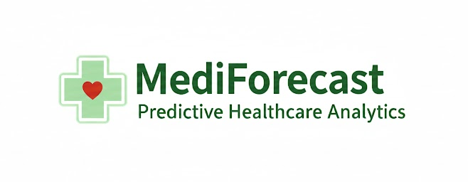
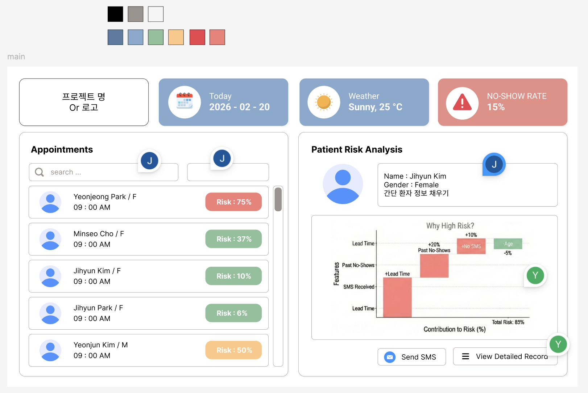
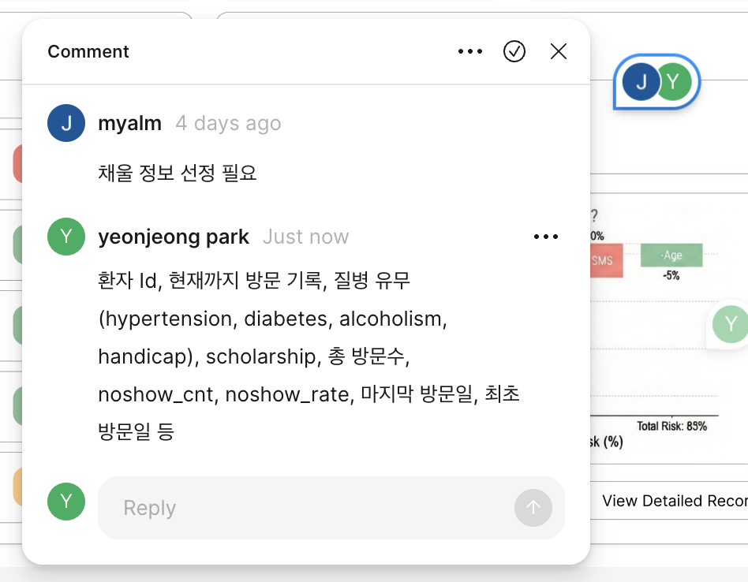
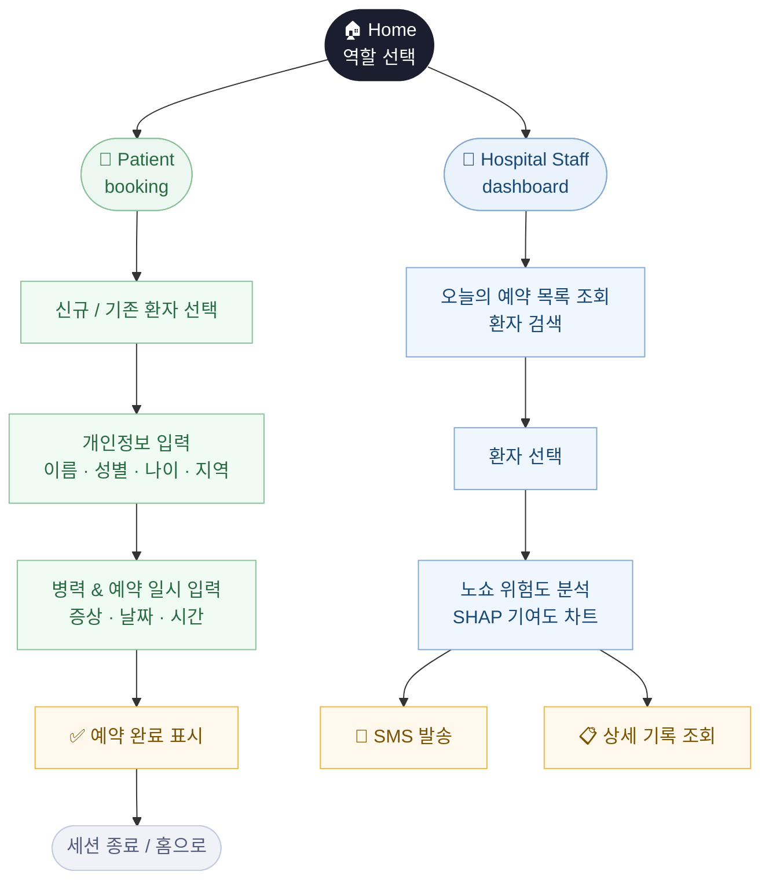
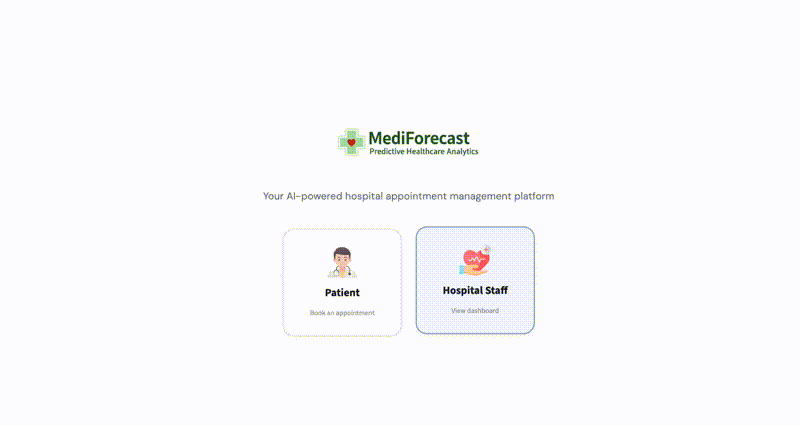
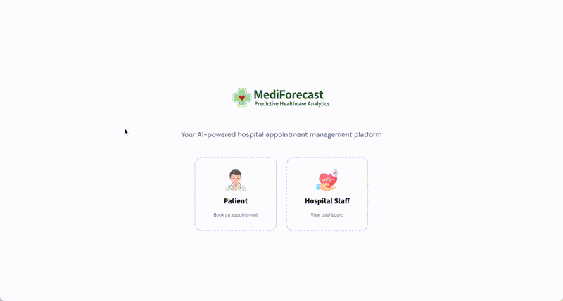
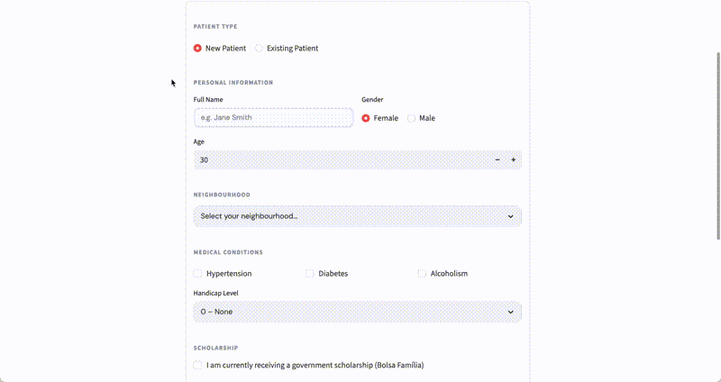
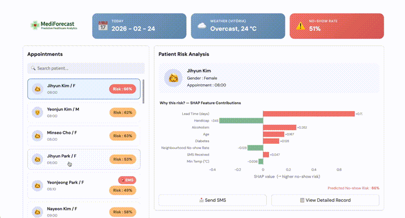

# SKN25-2nd-6Team

## 1. 팀 소개

<table>
  <tr>
    <th width="20%"><br><b>박연정</b></th>
    <th width="20%"><br><b>김지현</b></th>
    <th width="20%"><br><b>조민서</b></th>
    <th width="20%"><br><b>김연준</b></th>
    <th width="20%"><br><b>박지현</b></th>
  </tr>
  <tr>
    <td align="center"><b>팀장 / Leader</b></td>
    <td align="center"><b>팀원</b></td>
    <td align="center"><b>팀원</b></td>
    <td align="center"><b>팀원</b></td>
    <td align="center"><b>팀원</b></td>
  </tr>
  <tr>
    <td valign="top">
      • 데이터셋 조사 및 전처리<br>
      • XGBoost, CatBoost 모델링<br>
      • 산출물 보고서 작성<br>
      • ERD 설계<br>
      • UI/UX 기획 & streamlit 구현<br>
      • 발표자
    </td>
    <td valign="top">
      • 데이터셋 조사<br>
      • Logistic 회귀 분석 모델링<br>
      • 산출물 보고서 작성 <br>
      • 발표자료 작성
    </td>
    <td valign="top">
      • 데이터셋 조사 및 전처리<br>
      • LightGBM 모델링<br>
      • MLflow 구현<br>
      • README 작성 <br>
      • 산출물 보고서 작성
    </td>
    <td valign="top">
      • 딥러닝<br>
      • 응급/비응급 분류 모델 개발<br>
      • 발표자
    </td>
    <td valign="top">
      • 프로젝트 계획 수립 참여<br>
      • 데이터셋 조사
    </td>
  </tr>
</table>

<br>

## 2. 프로젝트 기간

2026.02.19 ~ 2026.02.24 (6일)

</br>

## 3. 프로젝트 개요

### 프로젝트명

**MediForecast**
</br>
> Predictive Healthcare Analytics
> 딥러닝·머신러닝 기반 응급도 분류 및 노쇼 예측 환자 관리 시스템


<br>

### 프로젝트 배경 및 목적

병원 예약 후 당일 미방문(No-Show)은 의료 자원의 낭비와 진료 공백을 유발하는 주요 문제이다.  
본 프로젝트는 환자의 예약 정보, 날씨, 지역 등 다양한 변수를 활용하여 **No-Show 발생 가능성을 사전에 예측**하고,  
나아가 환자의 증상 텍스트를 기반으로 **응급 여부를 자동 분류**하는 AI 모델을 개발하는 것을 목적으로 한다.

<br>

### 프로젝트 소개

본 프로젝트는 두 단계로 구성된다.

**1단계 — 머신러닝 기반 No-Show 예측**  
Kaggle Medical No-Show Dataset(`KaggleV2-May-2016.csv`)을 기반으로,  
단일 플랫 파일을 정규화된 다중 테이블 구조(Neighbourhood / Patients / Appointment / Calendar / Weather)로 전처리하였다.  
시간 순 기반 분할(70:15:15)을 적용하고 Logistic Regression, LightGBM, XGBoost, CatBoost 4가지 모델을 비교 평가하였다. </br>
-> **최종 선정 모델 : CatBoost**

<br>

**2단계 — 딥러닝 기반 응급 분류 모델**  
환자의 주증상 텍스트(Chief Complaint)와 나이·성별 수치 데이터를 융합한 **BERT 기반 멀티모달 모델**을 개발하였다.  
텍스트는 BERT로 임베딩을 추출하고, 수치 데이터는 MLP로 특징을 추출한 뒤 두 벡터를 concat하여  
응급(KTAS 1\~3) / 비응급(KTAS 4~5)을 분류한다.

<br>

### 기대효과

- 병원 운영 효율화 : No-Show 예측을 통해 대기 환자 배치 및 예약 슬롯 관리 최적화
- 의료 자원 절감 : 불필요한 예약 공백 감소로 진료 공백 최소화
- 응급 환자 신속 분류 : 증상 텍스트 기반 자동 응급 분류로 초기 트리아지(Triage) 보조 가능

> **Triage** : 응급상황 시 치료의 우선순위를 정하기 위한 환자 분류 체계

<br>

### 대상 사용자

- 병원 예약 관리 담당자 (No-Show 예측 활용)
- 응급실 담당 의료진 (응급 분류 모델 활용)
- 환자

</br>

# 4. 기술 설계 및 모델
### 4.1 프로젝트 구조
```
SKN25-2ND-6TEAM/
├── data/
│   ├── demo/                        # 데모용 샘플 데이터
│   │   ├── appointments_demo_2016-06-03_2016-06-...csv
│   │   └── name.csv
│   ├── processed/                   # 전처리 완료 데이터
│   │   ├── Appointment.csv
│   │   ├── Calendar.csv
│   │   ├── emergency.csv
│   │   ├── Neighbourhood.csv
│   │   ├── Patients.csv
│   │   ├── processed_emergency.csv
│   │   ├── Train_table_full.csv
│   │   └── Weather.csv
│   └── raw/                         # 원본 데이터
│       ├── KaggleV2-May-2016.csv
│       └── demo_appointments.json
├── img/                             # 시각화 결과 이미지
│   ├── catboost/
│   ├── deeplearning/
│   ├── docs/
│   ├── lightgbm/
│   ├── logistic/
│   ├── xgboost/
|   └── mlflow/
├── mediforecast/                    # Streamlit 앱
│   ├── pages/
│   │   ├── 1_dashboard.py
│   │   └── 2_booking.py
│   ├── static/
│   │   ├── booking_style.css
│   │   └── logo.png
│   ├── utils/
│   │   ├── __init__.py
│   │   ├── constants.py
│   │   ├── demo_data.py
│   │   ├── ml_utils.py
│   │   ├── ui_helpers.py
│   │   └── weather_api.py
│   └── app.py
├── results/
│   ├── artifacts/                   # 분류 리포트 (CSV)
│   │   ├── classification_report_catboost.csv
│   │   ├── classification_report_lightgbm.csv
│   │   ├── classification_report_logistic.csv
│   │   └── classification_report_xgboost.csv
│   ├── docs/                        # 상세 보고서
│   │   ├── modeling_README.md
│   │   └── preprocessing_README.md
│   └── final_model/                 # 저장된 모델 파일
│       ├── catboost_model.joblib
│       ├── lgbm_trainonly_nhoodfreq.joblib
│       ├── logistic_feature_cols.joblib
│       ├── logistic_scaler.joblib
│       ├── logistic_trainonly_model.joblib
│       └── xgboost_model.joblib
├── src/
│   ├── dataset/
│   │   └── emergency_dataset.py
│   ├── eda/
│   │   ├── data_calendar_weather.py
│   │   └── data_preprocessor.py
│   ├── modeling/                    # 모델 학습 코드
│   │   ├── notebooks/
│   │   ├── catboost_train.py
│   │   ├── data_pipeline.py
│   │   ├── log_to_mlflow.py
│   │   └── xgboost_train.py
│   └── models/                      # 모델 클래스 정의
│       ├── bert_with_tabular.py
│       ├── emergency_preprocessor.py
│       ├── emergency_train.py
│       └── emergency_visualize.py
├── .gitignore
├── mlflow.db
└── README.md
```

</br>

### 4.2 ERD


</br>

### 4.3 🤖 No-Show 예측 모델
예약/내원 데이터의 시간 흐름을 고려해 **시간 순 기반 분할(Time-based split, 70:15:15)** 을 적용하였다.  
No-Show는 클래스 불균형 문제가 있으므로 단일 Accuracy 대신 **PR-AUC, Recall, F1** 을 중심 지표로 사용하였다.

**사용 피처**
| 카테고리 | 피처 |
|---|---|
| 예약 정보 | `scheduled_time`, `lead_time_days`, `sms_received` |
| 환자 정보 | `gender`, `has_hypertension`, `has_diabetes`, `has_alcoholism`, `has_handicap`, `scholarship` |
| 날짜/시간 | `month`, `is_weekend`, `is_holiday`, `is_before_holiday`, `is_after_holiday` |
| 날씨 | `max_temp`, `min_temp`, `precip_mm`, `weather`, `temp_range`, `is_rainy` |
| 지역 | `nhood_freq` (neighborhood 방문 빈도 인코딩) |

</br>


**파생 피처**
- 데이터 누수 방지를 위해 시간 순 분할 이후 생성
| 카테고리 | 피처 | 설명 |
|---|---|---|
| 지역 패턴 | `nhood_noshow_rate` | Train 기준 동네별 노쇼율 계산 후 Valid/Test에 매핑 |
| 환자 이력 | `patient_appt_count` | 해당 환자의 누적 예약 횟수 |
| 환자 이력 | `patient_noshow_count` | 해당 환자의 누적 노쇼 횟수 |
| 환자 이력 | `patient_noshow_rate` | 누적 노쇼율 (신규 환자의 경우 전체 평균 대체) |
| 환자 이력 | `is_first_visit` | 첫 방문 여부 (1=신규 환자) |
| 예약 패턴 | `same_day_appts` | 동일 환자의 당일 중복 예약 건수 |


**비교 모델:** Logistic Regression / LightGBM / XGBoost / CatBoost </br>

**1) Logistic Regression**

 

> threshold를 0.21로 낮춰 Recall을 확보했으나 Precision이 낮아 오탐 부담이 크다.

</br>
</br>

**2) LightGBM**


 

> 리프 중심 트리 분할(Leaf-wise)을 사용하는 **트리 기반 부스팅 모델**로, 전 모델 중 가장 높은 Recall(0.869)을 기록했으나 Precision이 낮아 오탐이 많다.

</br>
</br>

**3) XGBoost**

깊이 중심 트리 분할(Depth-wise)을 사용하는 **트리 기반 부스팅 모델**로,
`scale_pos_weight=3.786`으로 클래스 불균형을 직접 보정하였다.


> SHAP Interaction 분석 결과, `lead_time_days × nhood_noshow_rate` 조합이 가장 강한 상호작용을 보였다.
> 단기 예약 + 고노쇼율 지역 조합에서 큰 음의 인터랙션이 발생하며, **지역 집단 수준의 패턴**에 민감하게 반응하는 경향이 있다.

</br>
</br>

**4) CatBoost**

범주형 피처를 자동 처리하는 **트리 기반 부스팅 모델**로,
`auto_class_weights=Balanced`로 클래스 불균형을 자동 보정하였다.


> SHAP Interaction 분석 결과, `lead_time_days × patient_noshow_rate` 조합이 강한 상호작용을 보였다.
> 단기 예약 + 고노쇼율 환자 조합에서 노쇼 위험이 상승하며, **개인 이력 기반 패턴**을 더 세밀하게 포착한다.

</br>

**XGBoost vs CatBoost: SHAP 기반 모델 비교**
두 모델 모두 `lead_time_days`가 압도적 1위 피처이나, **2~4위 순위에서 차이**가 있었다.

| 순위 | XGBoost | CatBoost |
|---|---|---|
| 1 | `lead_time_days` | `lead_time_days` |
| 2 | `age` | `age` |
| 3 | `nhood_noshow_rate` (지역 수준) | `patient_noshow_rate` (개인 수준) |
| 4 | `patient_noshow_rate` | `nhood_noshow_rate` |

XGBoost는 지역 집단 패턴, CatBoost는 개인 이력 패턴을 우선시하였다.

</br>
</br>

### 4.4 응급 분류 모델 (BERT + MLP)
응급실 환자의 주증상 텍스트와 수치 데이터를 융합한 **멀티모달 딥러닝 모델**이다.  
KTAS 1\~3은 응급(1), KTAS 4~5는 비응급(0)으로 이진 분류한다.


</br>

**데이터 전처리**
| 항목 | 내용 |
|---|---|
| 원본 데이터 | `emergency.csv` |
| 사용 컬럼 | `Chief_complain`, `KTAS_expert`, `Age`, `Sex` |
| 타깃 생성 | KTAS 1\~3 → 응급(1), KTAS 4~5 → 비응급(0) |
| 나이 정규화 | `age_norm = age / 120` |
| 성별 변환 | 2(여)→0, 1(남)→1 |
| 텍스트 정제 | 줄바꿈/탭/특수문자 제거, 3자 미만 제거 |

</br>

## 5. 수행결과
### No-Show 예측 모델 최종 성능

| Model | Valid ROC-AUC | Valid PR-AUC | Test ROC-AUC | Test PR-AUC | Best Threshold | Test Precision | Test Recall | Test F1 |
|---|---|---|---|---|---|---|---|---|
| Logistic Regression | 0.6305 | 0.2615 | 0.6712 | 0.2787 | 0.2128 | 0.2609 | 0.7439 | 0.3863 |
| LightGBM | 0.6857 | 0.2900 | 0.7013 | 0.2874 | 0.2296 | 0.2581 | 0.8689 | 0.3979 |
| XGBoost | 0.7250 | 0.3456 | 0.7266 | 0.3209 | 0.4449 | 0.2791 | 0.7908 | 0.4126 |
| **CatBoost** | **0.7319** | **0.3493** | **0.7358** | **0.3308** | 0.5099 | **0.2937** | 0.7550 | **0.4229** |

> **최종 선정 모델 : CatBoost** — PR-AUC, ROC-AUC, F1 전 지표 1위</br>
> 성능 뿐만 아니라 개별 환자 관리 및 노쇼 예측 목적을 고려할 때 **개인화 예측에 유리한 CatBoost**가 더 적합하다고 판단하였다.</br>
> 더 자세한 SHAP 분석은[`results/docs/modeling_README.md`](./results/docs/modeling_README.md) 참고

</br>

### 응급 분류 모델 최종 성능 (BERT + MLP)
| Epoch | Train Loss | Train Acc | Val Loss | Val Acc |
|---|---|---|---|---|
| 1 | 0.6660 | 0.6089 | 0.6030 | 0.7097 |
| 2 | 0.5735 | 0.7319 | 0.5348 | **0.7702** ← best |
| 3 | 0.5027 | 0.7752 | 0.5276 | 0.7621 |

</br>

## 6. 화면 설계
### 6.1. 화면설계서
<table>
  <tr>
    <td></td>
    <td></td>
  </tr>
  <tr>
    <td align="center">Main Dashboard</td>
    <td align="center">Comment Feature</td>
  </tr>
</table>

> Figma로 제작한 UI 목업
> 초기 설계에 포함된 이름 순 필터링 기능은 개발 우선순위 조정으로 최종 구현에서 제외되었습니다.

### 6.2 화면흐름도

### 6.3. 시연 영상

#### **📊 Dashboard**



- 초기 화면에서 **Hospital Staff**를 선택하면 오늘 예약된 환자 목록을 확인할 수 있습니다.
- 상단에는 **Weather API**를 통해 브라질 비토리아 시의 실시간 날씨 정보를 제공합니다.
- 하단 좌측 패널에서는 예약 시간 순으로 환자 목록을 확인할 수 있으며, 노쇼 확률 **65% 이상인 환자는 빨간색**으로 강조 표시됩니다. 응급 환자의 경우 🚨 이모지가 함께 표시됩니다.
- 하단 우측 패널에서는 선택된 환자의 노쇼 확률과 함께, **CatBoost + SHAP 분석** 기반으로 노쇼에 기여하는 상위 7개 요인을 막대그래프로 시각화합니다.
- **View Detailed Record** 버튼을 통해 환자의 기저질환 및 입력 증상 등 상세 정보를 확인할 수 있습니다.

---

#### **📋 기존 환자 예약**</br>



</br>

- 기존 환자의 이름을 검색하면 이전에 입력된 기록을 불러올 수 있으며, 정보 업데이트가 가능합니다.

---

#### **🆕 신규 환자 예약**</br>



</br>

- 이름, 나이, 지역, 기저질환 여부(Hypertension / Diabetes / Alcoholism), Scholarship 수혜 여부, 희망 진료 날짜 및 방문 시간을 입력할 수 있습니다.
- 현재 증상을 텍스트로 입력하면 **BERT 기반 딥러닝 모델**이 환자의 응급도를 자동으로 분류합니다. (응급: 1 / 비응급: 0)

---

##### **🧪 예약 확인**</br>



</br>

- 신규 환자가 입력한 예약 항목이 병원 예약 리스트에 정상적으로 등록된 것을 확인할 수 있습니다.
- **View Detailed Record** 버튼을 통해 환자가 입력한 증상 및 상세 정보를 조회할 수 있습니다.

---

# 7. 기술 스택

| 분류 | 기술 |
|---|---|
| **Backend & Modeling** |       |
| **Deep Learning** |     |
| **Frontend** |   |
| **Collaboration** |    |
| **실험 관리** |    |

</br>

# 7. 한 줄 회고
박연정
> 데이터 전처리부터 모델링, SHAP 기반 해석, 시각화까지 머신러닝 파이프라인 전 과정에 참여할 수 있어 의미 있는 프로젝트였습니다.</br>
의료 데이터의 시계열적 특성을 고려한 시점 기준 피처 엔지니어링으로 데이터 누수를 방지하며, 올바른 피처 설계가 모델 성능만큼 중요하다는 것을 배웠고,</br>
XGBoost와 CatBoost를 동일 조건에서 비교해보면서 모델 선택에 따른 성능 차이와 동작 방식의 차이를 직접 체감할 수 있었습니다.</br>
파라미터 튜닝이나 피처 엔지니어링보다 좋은 데이터가 먼저라는 것을 이번 프로젝트를 통해 다시 한 번 실감했습니다.

김지현
> 이번 프로젝트를 통해 팀원들과 협업의 중요성을 다시 한 번 느낄 수 있었습니다. </br>
 각자가 다른 모델을 직접 학습시키고 성능을 비교해본 경험은 특히 값진 시간이었습니다. </br>
 모델 성능 개선과 해석 과정에서 다양한 관점을 공유하며 더 나은 방향을 찾을 수 있었습니다. </br>
 데이터 이슈와 튜닝 과정이 쉽지 않았지만, 함께 고민하며 해결해 나갈 수 있어 의미 있었습니다.

조민서
> 데이터셋 조사부터 전처리, LightGBM 모델링, MLflow 실험 관리까지 직접 구현하며 머신러닝 파이프라인의 전 과정을 경험할 수 있었습니다. </br>
팀원들과 서로 다른 모델을 맡아 비교하고 의견을 나누는 과정에서 혼자였다면 보지 못했을 시각을 얻을 수 있었고, 협업의 힘을 다시 한 번 실감했습니다. </br>
README와 보고서 작성까지 마무리하며 프로젝트의 시작부터 끝을 직접 책임져본 경험이었고, 각자의 역할에 최선을 다해준 팀원들 덕분에 좋은 결과를 낼 수 있었습니다.

김연준
> 
