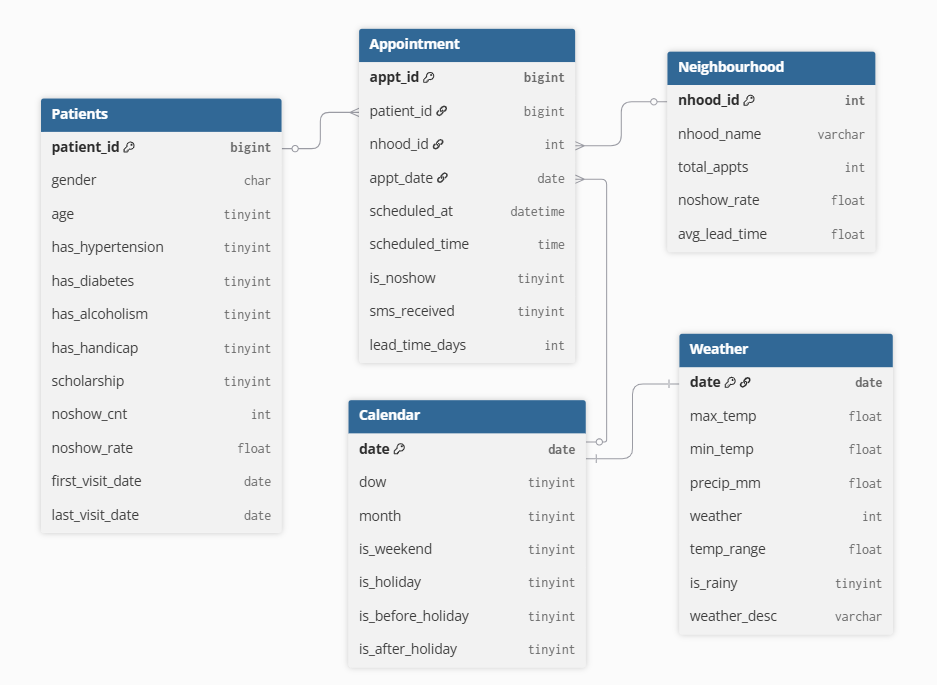
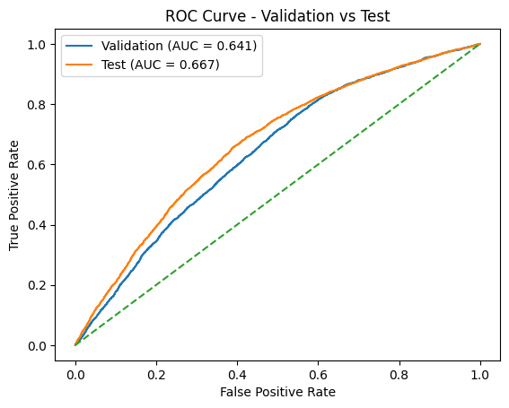
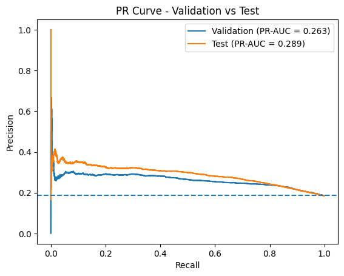
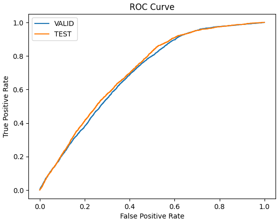
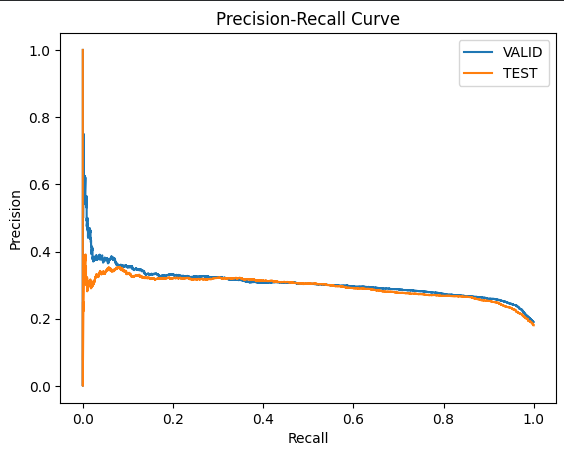
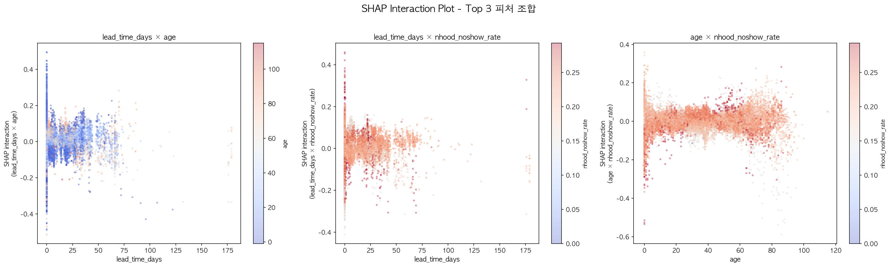
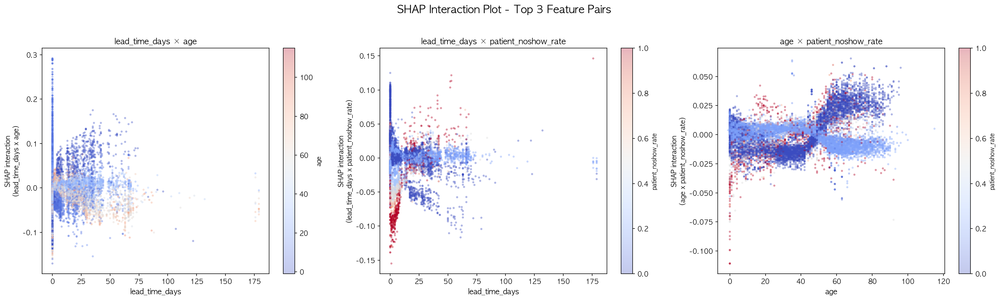
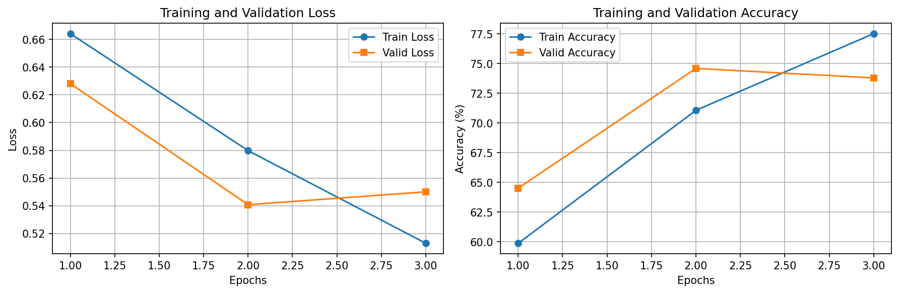
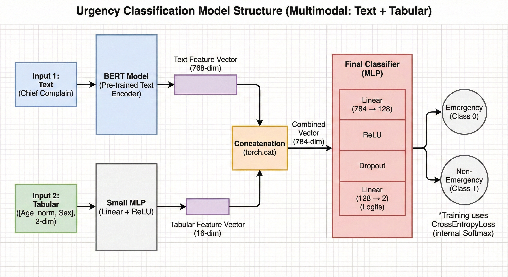

# SKN25-2nd-6Team
> 딥러닝·머신러닝 기반 응급도 분류 및 노쇼 예측 환자 관리 시스템

</br>

## 1. 팀 소개

<table>
  <tr>
    <th width="20%"><br><b>박연정</b></th>
    <th width="20%"><br><b>김지현</b></th>
    <th width="20%"><br><b>조민서</b></th>
    <th width="20%"><br><b>김연준</b></th>
    <th width="20%"><br><b>박지현</b></th>
  </tr>
  <tr>
    <td align="center"><b>팀장 / Leader</b></td>
    <td align="center"><b>팀원</b></td>
    <td align="center"><b>팀원</b></td>
    <td align="center"><b>팀원</b></td>
    <td align="center"><b>팀원</b></td>
  </tr>
  <tr>
    <td valign="top">
      • 데이터셋 조사 및 전처리<br>
      • XGBoost, CatBoost 모델링<br>
      • 산출물 보고서 작성<br>
      • ERD 설계<br>
      • UI/UX 기획 & streamlit 구현<br>
      • 발표자
    </td>
    <td valign="top">
      • 데이터셋 조사<br>
      • Logistic 회귀 분석 모델링<br>
      • 발표자료 작성
    </td>
    <td valign="top">
      • 데이터셋 조사 및 전처리<br>
      • LightGBM 모델링<br>
      • MLflow 구현<br>
      • README 작성 <br>
      • 산출물 보고서 작성
    </td>
    <td valign="top">
      • 딥러닝<br>
      • 응급/비응급 분류 모델 개발<br>
      • 발표자
    </td>
    <td valign="top">
      • 프로젝트 계획 수립 참여<br>
      • 데이터셋 조사
    </td>
  </tr>
</table>

<br>


## 2. 프로젝트 기간

2026.02.19 ~ 2026.02.24 (6일)

</br>

## 3. 프로젝트 개요

### 프로젝트명

**MediForecast**
> Predictive Healthcare Analytics

<br>

### 프로젝트 배경 및 목적

병원 예약 후 당일 미방문(No-Show)은 의료 자원의 낭비와 진료 공백을 유발하는 주요 문제이다.  
본 프로젝트는 환자의 예약 정보, 날씨, 지역 등 다양한 변수를 활용하여 **No-Show 발생 가능성을 사전에 예측**하고,  
나아가 환자의 증상 텍스트를 기반으로 **응급 여부를 자동 분류**하는 AI 모델을 개발하는 것을 목적으로 한다.

<br>

### 프로젝트 소개

본 프로젝트는 두 단계로 구성된다.

**1단계 — 머신러닝 기반 No-Show 예측**  
Kaggle Medical No-Show Dataset(`KaggleV2-May-2016.csv`)을 기반으로,  
단일 플랫 파일을 정규화된 다중 테이블 구조(Neighbourhood / Patients / Appointment / Calendar / Weather)로 전처리하였다.  
시간 순 기반 분할(70:15:15)을 적용하고 Logistic Regression, LightGBM, XGBoost, CatBoost 4가지 모델을 비교 평가하였다. </br>
-> **최종 선정 모델 : CatBoost**

<br>

**2단계 — 딥러닝 기반 응급 분류 모델**  
환자의 주증상 텍스트(Chief Complaint)와 나이·성별 수치 데이터를 융합한 **BERT 기반 멀티모달 모델**을 개발하였다.  
텍스트는 BERT로 임베딩을 추출하고, 수치 데이터는 MLP로 특징을 추출한 뒤 두 벡터를 concat하여  
응급(KTAS 1\~3) / 비응급(KTAS 4~5)을 분류한다.

<br>

### 기대효과

- 병원 운영 효율화 : No-Show 예측을 통해 대기 환자 배치 및 예약 슬롯 관리 최적화
- 의료 자원 절감 : 불필요한 예약 공백 감소로 진료 공백 최소화
- 응급 환자 신속 분류 : 증상 텍스트 기반 자동 응급 분류로 초기 트리아지(Triage) 보조 가능

> **Triage** : 응급상황 시 치료의 우선순위를 정하기 위한 환자 분류 체계

<br>

### 대상 사용자

- 병원 예약 관리 담당자 (No-Show 예측 활용)
- 응급실 담당 의료진 (응급 분류 모델 활용)

</br>

# 4. 기술 설계 및 모델
### 4.1 프로젝트 구조
```
SKN25-2ND-6TEAM/
├── data/
│   ├── demo/                        # 데모용 샘플 데이터
│   │   ├── appointments_demo_2016-06-03_2016-06-...csv
│   │   └── name.csv
│   ├── processed/                   # 전처리 완료 데이터
│   │   ├── Appointment.csv
│   │   ├── Calendar.csv
│   │   ├── emergency.csv
│   │   ├── Neighbourhood.csv
│   │   ├── Patients.csv
│   │   ├── processed_emergency.csv
│   │   ├── Train_table_full.csv
│   │   └── Weather.csv
│   └── raw/                         # 원본 데이터
│       ├── KaggleV2-May-2016.csv
│       └── demo_appointments.json
├── img/                             # 시각화 결과 이미지
│   ├── catboost/
│   ├── deeplearning/
│   ├── docs/
│   ├── lightgbm/
│   ├── logistic/
│   ├── xgboost/
|   └── mlflow/
├── mediforecast/                    # Streamlit 앱
│   ├── pages/
│   │   ├── 1_dashboard.py
│   │   └── 2_booking.py
│   ├── static/
│   │   ├── booking_style.css
│   │   └── logo.png
│   ├── utils/
│   │   ├── __init__.py
│   │   ├── constants.py
│   │   ├── demo_data.py
│   │   ├── ml_utils.py
│   │   ├── ui_helpers.py
│   │   └── weather_api.py
│   └── app.py
├── results/
│   ├── artifacts/                   # 분류 리포트 (CSV)
│   │   ├── classification_report_catboost.csv
│   │   ├── classification_report_lightgbm.csv
│   │   ├── classification_report_logistic.csv
│   │   └── classification_report_xgboost.csv
│   ├── docs/                        # 상세 보고서
│   │   ├── modeling_README.md
│   │   └── preprocessing_README.md
│   └── final_model/                 # 저장된 모델 파일
│       ├── catboost_model.joblib
│       ├── lgbm_trainonly_nhoodfreq.joblib
│       ├── logistic_feature_cols.joblib
│       ├── logistic_scaler.joblib
│       ├── logistic_trainonly_model.joblib
│       └── xgboost_model.joblib
├── src/
│   ├── dataset/
│   │   └── emergency_dataset.py
│   ├── eda/
│   │   ├── data_calendar_weather.py
│   │   └── data_preprocessor.py
│   ├── modeling/                    # 모델 학습 코드
│   │   ├── notebooks/
│   │   ├── catboost_train.py
│   │   ├── data_pipeline.py
│   │   ├── log_to_mlflow.py
│   │   └── xgboost_train.py
│   └── models/                      # 모델 클래스 정의
│       ├── bert_with_tabular.py
│       ├── emergency_preprocessor.py
│       ├── emergency_train.py
│       └── emergency_visualize.py
├── .gitignore
├── mlflow.db
└── README.md
```

</br>

### 4.2 ERD


</br>

### 4.3 🤖 No-Show 예측 모델
예약/내원 데이터의 시간 흐름을 고려해 **시간 순 기반 분할(Time-based split, 70:15:15)** 을 적용하였다.  
No-Show는 클래스 불균형 문제가 있으므로 단일 Accuracy 대신 **PR-AUC, Recall, F1** 을 중심 지표로 사용하였다.

**사용 피처**
| 카테고리 | 피처 |
|---|---|
| 예약 정보 | `scheduled_time`, `lead_time_days`, `sms_received` |
| 환자 정보 | `gender`, `has_hypertension`, `has_diabetes`, `has_alcoholism`, `has_handicap`, `scholarship` |
| 날짜/시간 | `month`, `is_weekend`, `is_holiday`, `is_before_holiday`, `is_after_holiday` |
| 날씨 | `max_temp`, `min_temp`, `precip_mm`, `weather`, `temp_range`, `is_rainy` |
| 지역 | `nhood_freq` (neighborhood 방문 빈도 인코딩) |

</br>

**비교 모델:** Logistic Regression / LightGBM / XGBoost / CatBoost </br>

**1) Logistic Regression**

 

> threshold를 0.21로 낮춰 Recall을 확보했으나 Precision이 낮아 오탐 부담이 크다.

</br>
</br>

**2) LightGBM**


 

> 리프 중심 트리 분할(Leaf-wise)을 사용하는 **트리 기반 부스팅 모델**로, 전 모델 중 가장 높은 Recall(0.869)을 기록했으나 Precision이 낮아 오탐이 많다.

</br>
</br>

**3) XGBoost**

깊이 중심 트리 분할(Depth-wise)을 사용하는 **트리 기반 부스팅 모델**로,
`scale_pos_weight=3.786`으로 클래스 불균형을 직접 보정하였다.



> SHAP Interaction 분석 결과, `lead_time_days`, `age`, `nhood_noshow_rate` 조합이 예측에 가장 큰 영향을 미치는 것으로 나타났다.

</br>
</br>

**4) CatBoost**

범주형 피처를 자동 처리하는 **트리 기반 부스팅 모델**로,
`auto_class_weights=Balanced`로 클래스 불균형을 자동 보정하였다.



> SHAP Interaction 분석 결과, `lead_time_days`, `age`, `patient_noshow_rate` 조합이 예측에 가장 큰 영향을 미치는 것으로 나타났다.

</br>
</br>

### 4.4 응급 분류 모델 (BERT + MLP)
응급실 환자의 주증상 텍스트와 수치 데이터를 융합한 **멀티모달 딥러닝 모델**이다.  
KTAS 1\~3은 응급(1), KTAS 4~5는 비응급(0)으로 이진 분류한다.




</br>

**데이터 전처리**
| 항목 | 내용 |
|---|---|
| 원본 데이터 | `emergency.csv` |
| 사용 컬럼 | `Chief_complain`, `KTAS_expert`, `Age`, `Sex` |
| 타깃 생성 | KTAS 1\~3 → 응급(1), KTAS 4~5 → 비응급(0) |
| 나이 정규화 | `age_norm = age / 120` |
| 성별 변환 | 2(여)→0, 1(남)→1 |
| 텍스트 정제 | 줄바꿈/탭/특수문자 제거, 3자 미만 제거 |

</br>

# 5. 수행결과
### No-Show 예측 모델 최종 성능

| Model | Valid ROC-AUC | Valid PR-AUC | Test ROC-AUC | Test PR-AUC | Best Threshold | Test Precision | Test Recall | Test F1 |
|---|---|---|---|---|---|---|---|---|
| Logistic Regression | 0.6305 | 0.2615 | 0.6712 | 0.2787 | 0.2128 | 0.2609 | 0.7439 | 0.3863 |
| LightGBM | 0.6857 | 0.2900 | 0.7013 | 0.2874 | 0.2296 | 0.2581 | 0.8689 | 0.3979 |
| XGBoost | 0.7250 | 0.3456 | 0.7266 | 0.3209 | 0.4449 | 0.2791 | 0.7908 | 0.4126 |
| **CatBoost** | **0.7319** | **0.3493** | **0.7358** | **0.3308** | 0.5099 | **0.2937** | 0.7550 | **0.4229** |

> **최종 선정 모델 : CatBoost** — PR-AUC, ROC-AUC, F1 전 지표 1위

</br>

### 응급 분류 모델 최종 성능 (BERT + MLP)
| Epoch | Train Loss | Train Acc | Val Loss | Val Acc |
|---|---|---|---|---|
| 1 | 0.6660 | 0.6089 | 0.6030 | 0.7097 |
| 2 | 0.5735 | 0.7319 | 0.5348 | **0.7702** ← best |
| 3 | 0.5027 | 0.7752 | 0.5276 | 0.7621 |

</br>

# 6. 기술 스택

| 분류 | 기술 |
|---|---|
| **Backend & Modeling** |       |
| **Deep Learning** |     |
| **Frontend** |   |
| **Collaboration** |    |
| **실험 관리** |    |

</br>

# 7. 한 줄 회고
> 박연정 :

> 김지현 :

> 조민서 :

> 김연준 :
